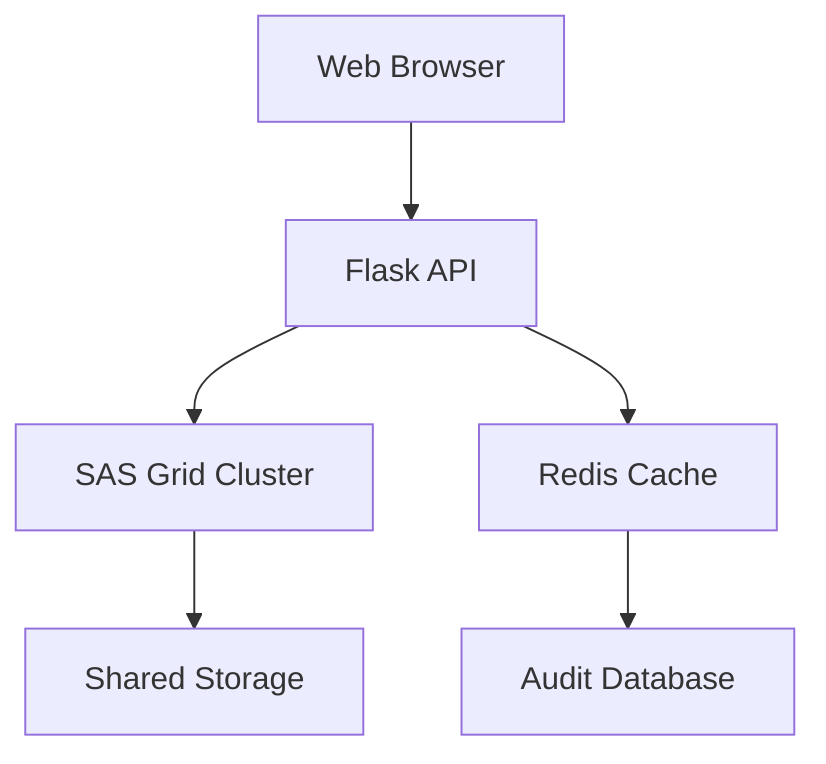

# Actuarial Decrement Analysis Platform

## Overview
Professional platform for actuaries to analyze mortality data with:
1. Secure data pipelines from HMD/CDC sources
2. Advanced actuarial modeling (Lee-Carter, CBD, Gompertz)
3. SOA-compliant diagnostic reporting
4. Multi-dimensional results comparison

## Key Features
- **Secure Data Handling**
  - End-to-end encryption
  - SAS Docker sandboxing
  - SOX-compliant audit logging
- **Professional Analysis**
  - Mortality data validation
  - SOA 2023 report templates
  - Digital signature for reports
- **Performance Optimization**
  - SAS Grid integration
  - Redis caching
  - Priority job scheduling
- **User Experience**
  - Interactive data preview
  - Context-sensitive help
  - One-click PDF/CSV export

## System Architecture


## Getting Started
### Prerequisites
- Python 3.8+
- Node.js 14+
- SAS 9.4+ with Grid
- Docker
- Redis

### Installation
```bash
# Clone repository
git clone https://your-repo-url/actuarial-platform.git

# Backend setup
cd backend
pip install -r requirements.txt
export SAS_GRID_USER=your_username
export SAS_GRID_PASS=your_password

# Frontend setup
cd ../web
npm install
```

### Running Application
```bash
# Start backend
cd backend
python app.py

# Start frontend
cd ../web
npm start
```

### API Endpoints
| Endpoint | Method | Description |
|----------|--------|-------------|
| `/api/fetch-data` | POST | Fetch HMD/CDC data |
| `/api/upload-custom-data` | POST | Process custom files |
| `/api/clean-data` | POST | Apply data cleaning |
| `/api/generate-report` | POST | Create diagnostic report |

## Technical Stack
- **Frontend**: Bootstrap 5, jQuery, Plotly.js
- **Backend**: Python Flask, SAS Grid
- **Data Processing**: Pandas, NumPy, PyArrow
- **Caching**: Redis
- **Auditing**: SQL Database

## License
MIT License - For academic and research use only
```
