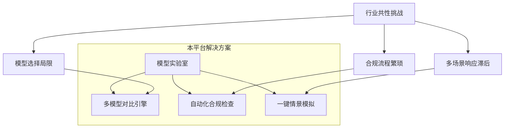
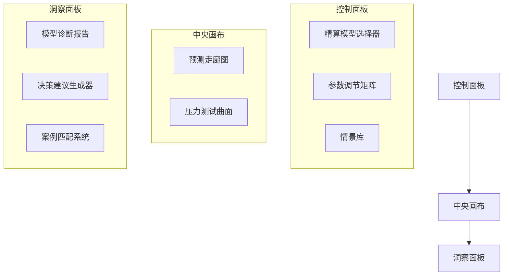
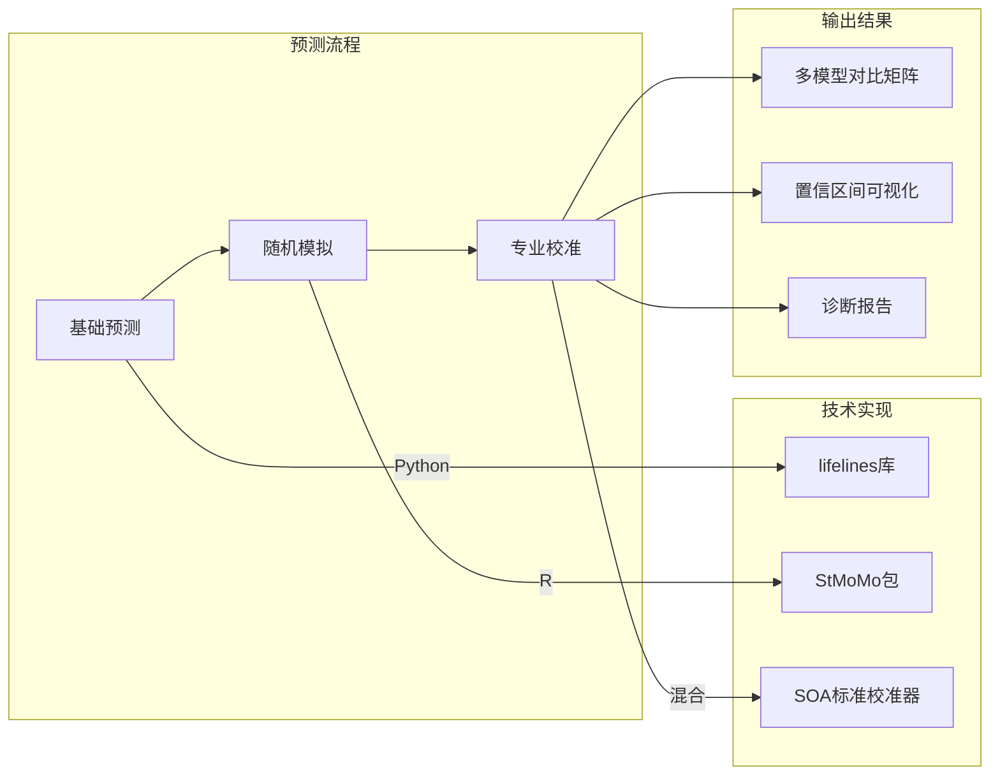
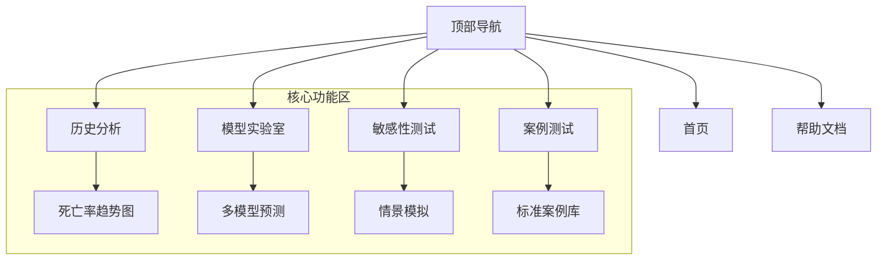
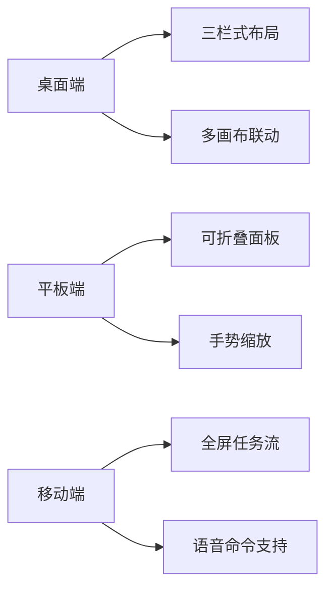

# Actuarial Decrement: 精算减量表分析与预测平台

[](https://www.python.org/)
[](https://www.r-project.org/)
[](https://opensource.org/licenses/MIT)
[](https://www.soa.org)

## 项目核心价值

精算减量表分析在实践中常面临**模型选择局限**、**合规流程繁琐**、**多场景响应滞后**等行业共性挑战。本平台通过构建「精算模型实验室」，提供从历史数据分析到多情景预测的全流程支持，帮助精算师将精力聚焦于风险洞察而非工具操作。




🖥 专业可视化系统  
三屏交互体系




| 视图类型       | 核心功能                             |
|----------------|----------------------------------|
| <i class="fa-solid fa-layer-group"></i> 预测走廊图     | 多模型预测区间对比<br>SOA标准置信带渲染    |
| <i class="fa-solid fa-spider"></i> 准备金蛛网图   | 多维敏感性分析<br>监管阈值预警线          |
| <i class="fa-solid fa-square-poll-vertical"></i> 回溯测试矩阵   | 历史预测准确性评估<br>误差分布热力图        |


🧪 核心创新：精算模型实验室  
独特的三阶预测框架




 
与传统工具的差异
| 功能维度     | 普通分析工具       | 本平台                 | 精算价值                 |
| ------------ | ------------------ | ---------------------- | ------------------------ |
| 死亡率预测   | 简单趋势外推       | ✅ 随机 CBD 模拟       | 符合 IFRS17 要求         |
| 模型验证     | 无系统验证         | ✅ SOA 案例回溯测试    | 确保结果可靠性           |
| 合规设计     | 基础声明           | ✅ 交互式知情确认      | 明确责任边界             |
| 情景分析     | 静态表格           | ✅ 动态参数调节        | 支持极端风险评估         |

核心代码实现  
### 核心代码实现

```python
def actuarial_forecast(data):
    # 第一阶段：Python实现Lee-Carter基础预测
    lc_forecast = lee_carter_base(data)

    # 第二阶段：R实现CBD随机模拟（通过rpy2集成）
    with rpy2.robjects.packages.importr('StMoMo'):
        cbd_sim = r('cbd_simulation(n = 1000)')  # 1000次随机模拟

    # 第三阶段：SOA标准校准
    return soa_calibration(lc_forecast, cbd_sim)
```

模型诊断面板

```html
预览
<div class="diagnostic-report">
  <h6>模型拟合诊断</h6>
  <div class="metrics-grid">
    <metric-card title="AIC值" value="743.2" benchmark="<750"></metric-card>
    <metric-card title="残差自相关" value="0.12" benchmark="<0.2"></metric-card>
    <metric-card title="回溯测试准确率" value="92%" benchmark=">85%"></metric-card>
  </div>
</div>
```

⚙️ 快速体验预测功能  
通过 SOA 案例启动  
### 模型诊断面板 HTML 预览  

#### 模型拟合诊断  
- 快速体验预测功能：通过 SOA 案例启动    

```bash
# 加载 SOA 2023 真题数据集
python load_soa_case.py --exam=spring2023 --question=5
```

### 启动预测沙箱

```r
Rscript -e "shiny::runApp('model_lab')"
```

预测工作流  
选择对比模型  
Lee-Carter  
CBD  
APC  

### 设置精算参数（YAML 格式）  

```yaml
time_horizon: 5  # 预测年限
confidence_level: 95  # SOA标准置信水平
n_simulations: 1000  # 随机模拟次数
```

执行回溯测试验证准确性  
导出压力测试报告  


🖥️ 网页功能模块  
整体架构  




关键页面功能  
1. 历史分析页面  
多维度筛选：国家 / 地区、时间范围、年龄组、性别  
可视化形式：趋势线图、年龄 - 年份热力图、疫情冲击分析  
数据操作：支持 CSV 导出、自定义指标计算

2. 模型实验室页面  

```html
预览
<div class="model-lab">
  <!-- 模型选择器 -->
  <div class="model-selector">
    <div class="as-button" data-model="lee-carter">Lee-Carter</div>
    <div class="as-button" data-model="cbd">CBD</div>
    <div class="as-button" data-model="apc">APC</div>
  </div>
  
  <!-- 参数设置 -->
  <div class="actuarial-params">
    <label>预测年限：</label>
    <input type="range" min="1" max="10" value="3" class="as-slider">
    
    <label>置信水平：</label>
    <select class="as-select">
      <option>90% (CAS标准)</option>
      <option selected>95% (SOA标准)</option>
      <option>99% (Solvency II)</option>
    </select>
  </div>
</div>
```

3. 敏感性测试页面  
三栏布局：控制面板 → 图表区 → 结果摘要  
情景选择：基准 / 疫情延续 / 二次爆发 / 自定义  
参数调节：冲击强度 (0.8-1.5)、尾部效应类型、年龄组系数  
实时输出：准备金影响百分比、死亡率曲线偏移、PDF 报告生成

4. 案例测试页面  
内置 5 + 标准案例：  
疫情对年金产品的影响分析  
长寿风险建模与评估  
极端事件对减量表的冲击  
一键运行：自动加载数据并生成对比报告

🚀 快速开始  
本地部署  
```bash
# 克隆仓库
git clone https://github.com/MondscheinDativ/Actuarial-Decrement.git
cd actuarial-decrement

# 安装依赖
pip install -r requirements.txt
Rscript install_packages.R

# 启动服务
python app.py  # 后端服务，默认端口5000
# 同时启动前端（新终端）
cd frontend && npm start  # 前端服务，默认端口3000
访问地址：http://localhost:3000
```

📜 专业免责系统  
法律声明集成  

```html
预览
<div class="disclaimer-card">
  <h5><i class="fa-solid fa-scale-balanced"></i> 精算预测使用规范</h5>
  <ul>
    <li>本工具符合SOA教育标准，输出结果未经持证精算师复核不得用于商业决策</li>
    <li>使用者须确认理解<a href="#">模型假设手册</a>中的关键限制</li>
    <li>所有预测结果自动添加"SOA-EDU-DEMO"浮动水印</li>
  </ul>
  <div class="signature-block">
    <input type="checkbox" id="disclaimer-agree">
    <label for="disclaimer-agree">确认理解并接受上述条款</label>
  </div>
</div>
```

🌐 可视化设计规范  
精算专业配色系统  
| 用途       | 色值      | 示例展示                                                                 |
|------------|-----------|--------------------------------------------------------------------------|
| 基准数据   | #3498db   | <div style="background-color:#3498db;width:50px;height:20px;"></div>     |
| 预测区间   | #f39c12   | <div style="background-color:#f39c12;width:50px;height:20px;"></div>     |
| 风险预警   | #e74c3c   | <div style="background-color:#e74c3c;width:50px;height:20px;"></div>     |
| SOA 标准   | #2c3e50   | <div style="background-color:#2c3e50;width:50px;height:20px;"></div>     |

响应式布局方案




项目愿景  
精算师的核心价值不在于复杂的计算，而在于对风险本质的洞察。本平台通过自动化重复性工作，让精算师能专注于：  
极端风险的识别与评估  
模型假设的合理性判断  
业务场景的深度解读  
"工具的终极目标是让专业人士回归思考本身"  

### 📅 产品迭代路线图（即将上线）

#### 🔹 核心功能增强
- **精算计算器** ✅ 开发中  
  集成减量表常用指标计算模块，支持一键导出计算过程

#### 🔹 性能优化
- **加载提速** ⚡ 测试中  
  静态资源压缩+预加载策略，目标加载时间缩短30%以上  
- **图表引擎升级** 🖼️ 开发中  
  采用WebGL渲染，内存占用降低50%，支持百万级数据流畅展示

#### 🔹 数据安全
- **智能异常检测** 🔍 待上线  
  基于Z-score算法自动标记异常值，支持自定义风险阈值（默认±3σ）

#### 🔹 内容扩展
- **案例库扩容** 📚 规划中  
  新增"长寿风险""疫情后复苏"等5个行业标杆案例  
- **社区贡献机制** 👥 规划中  
  开放模型提交通道，建立贡献者认证体系


"工具的进化方向，是让精算师的专业判断更聚焦于风险本质"—— Actuarial Decrement 核心设计理念


项目维护频率：每周  
联系方式：GitHub  
最后更新：2025 年 7 月  
开源协议：MIT（核心代码） + GPLv3（R/Python 依赖库）
