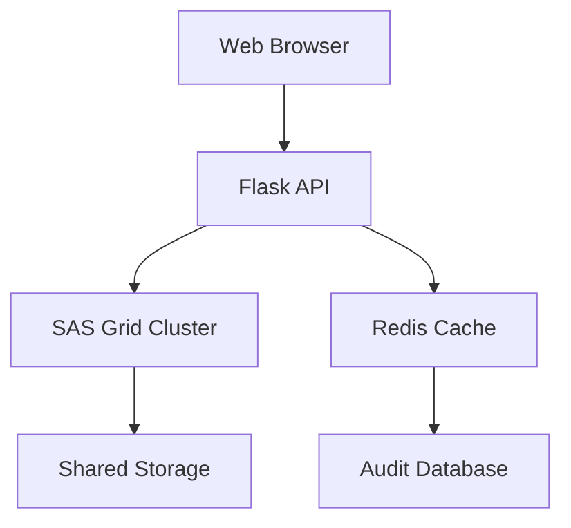

## Overview
This platform provides a comprehensive solution for actuaries to:
1. Fetch mortality data from authoritative sources (HMD, CDC)
2. Process custom datasets via file upload or API
3. Clean and validate data using actuarial methods
4. Generate SOA-compliant diagnostic reports
5. Maintain full data lineage for audit compliance

## Key Features
- **Secure Data Handling**
  - End-to-end encryption of sensitive data
  - SAS script execution in Docker sandboxes
  - Detailed audit logging (SOX compliant)

- **Professional Actuarial Processing**
  - Mortality data special validation
  - SOA 2023 standard report templates
  - Digital signature for reports

- **Performance Optimization**
  - SAS Grid integration for large datasets
  - Redis caching for frequent operations
  - Priority scheduling for actuarial jobs

- **User-Friendly Interface**
  - Interactive data preview with pagination
  - Context-sensitive help system
  - One-click PDF/CSV report export

## System Architecture


## Getting Started
1. **Prerequisites**:
   - Python 3.8+
   - SAS 9.4+ with Grid configuration
   - Docker
   - Redis

2. **Installation**:
   ```bash
   pip install -r requirements.txt
   export SAS_GRID_USER=your_username
   export SAS_GRID_PASS=your_password
   ```

3. **Run Application**:
   ```bash
   python app.py
   ```

4. **Access UI**:
   Open `http://localhost:5000` in your browser

## API Endpoints
| Endpoint | Method | Function |
|----------|--------|----------|
| `/api/fetch-data` | POST | Fetch HMD/CDC data |
| `/api/upload-custom-data` | POST | Process custom files |
| `/api/clean-data` | POST | Apply data cleaning |
| `/api/generate-report` | POST | Create diagnostic report |# Decrement---analysis
