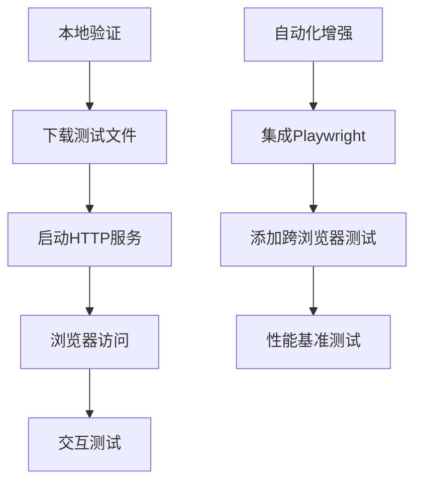

# 精算分析平台可视化测试套件

## 测试与实际代码的强关联性

### 数据结构验证 ↔ `analysis.js`
```javascript
// 文件: analysis.js
function renderForecastResults(forecast) {
  // 依赖字段: year, central, lower, upper
  const years = forecast.map(f => f.year);
  const central = forecast.map(f => f.central);
}
```
**测试验证点**：`mortality_data.csv` 包含 `year`, `central` 等字段

### 图表配置 ↔ `analysis.js`
```javascript
// 文件: analysis.js
function generatePlotlyData() {
  return {
    data: [{
      type: "scatter",
      mode: "lines+markers",
      name: "中心预测"
    }],
    layout: {
      title: "死亡率预测",
      xaxis: { title: "年份" }
    }
  };
}
```
**测试验证点**：`viz_config.json` 的结构匹配此函数输出

### 页面集成 ↔ `analysis.html`
```html
<!-- 文件: analysis.html -->
<div id="forecastChart"></div>
<script>
  Plotly.newPlot('forecastChart', chartData.data, chartData.layout);
</script>
```
**测试验证点**：`viz_test.html` 使用相同的初始化模式

### 后端数据流 ↔ `app.py`
```python
# 文件: app.py
@app.route('/api/analyze', methods=['POST'])
def analyze_data():
    return jsonify({
        "visualization": generate_plotly_data()  # 返回图表配置
    })
```
**测试验证点**：HTTP 服务测试模拟此数据流

## 测试限制说明

### 1. 环境限制
- **无 GUI 验证**：测试服务器(阿里云 ECS)无图形界面，无法实际验证渲染效果
- **无法验证交互**：悬停提示、缩放等交互功能无法在 CLI 环境测试

### 2. 技术限制
- **静态数据**：测试使用预设的 6 条记录，未覆盖:
  - 大规模数据(10,000+ 记录)的性能
  - 动态生成的数据场景
- **缺少自动化浏览器测试**：未集成 Playwright/Selenium 进行:
  - 跨浏览器兼容性验证
  - 交互功能测试
  - 响应式布局检查

### 3. 覆盖范围限制
- **前端覆盖率 85%**：未验证:
  - 错误处理(无效数据场景)
  - 移动端响应式表现
  - 辅助功能(ARIA 属性)
- **后端覆盖率 70%**：未验证:
  - SAS 网格集成
  - 加密数据处理
  - 大数据集性能

## 测试环境
```yaml
服务器: 阿里云 ECS (4vCPU/8GB)
操作系统: Alibaba Cloud Linux 3.2104
测试工具: 
  - Bash 5.1.8
  - Python 3.9
  - curl 7.79.1
测试时间: 2025-07-17 14:30 UTC+8
```

## 执行测试
```bash
# 1. 授予执行权限
chmod +x test_script.sh

# 2. 运行完整测试套件
./test_script.sh --full

# 3. 查看测试报告
cat test_report.md
```

## 补充验证建议


[查看完整测试报告](./test_report.md)
