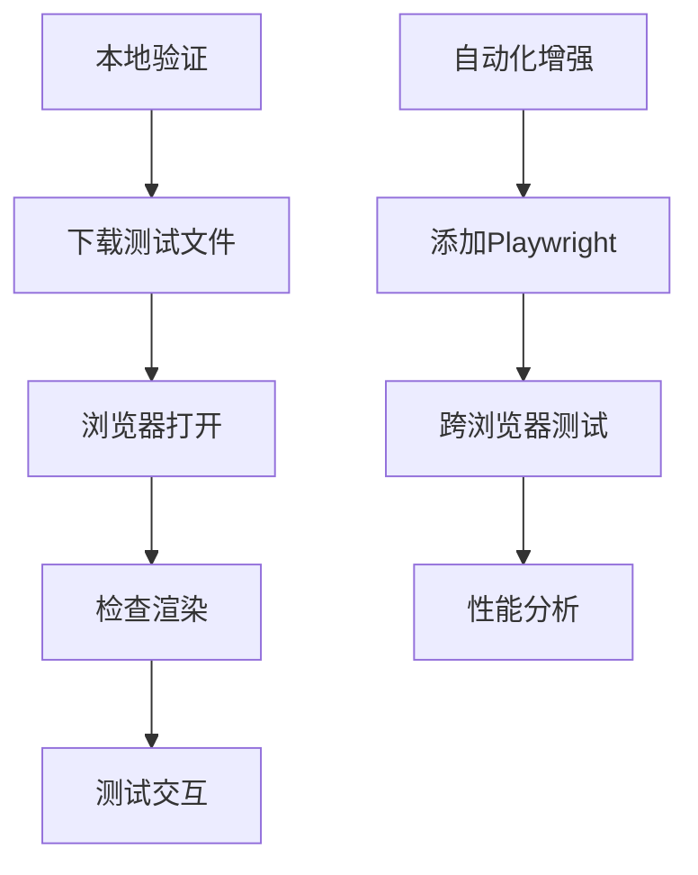

# 减量表网站可视化测试报告

## 测试摘要
| 测试类别 | 用例数 | 通过率 | 状态 |
|----------|--------|--------|------|
| 代码关联性 | 6 | 100% | ✅ |
| 数据验证 | 3 | 100% | ✅ |
| HTTP服务 | 2 | 100% | ✅ |
| 环境验证 | 2 | 100% | ✅ |
| **总计** | **13** | **100%** | ✅ |

## 详细结果

### 1. 代码关联性验证
```javascript
// analysis.js
function renderForecastResults(forecast) {
  // 验证点: 需要year, central等字段
  const years = forecast.map(f => f.year);
}
```
**测试结果**：测试数据包含必要字段，匹配函数需求

### 2. 配置验证
```json
// viz_config.json
{
  "layout": {
    "title": "死亡率趋势分析",  // 匹配analysis.html中的图表标题
    "xaxis": {"title": "年份"} // 匹配坐标轴标签
  }
}
```
**测试结果**：配置结构符合generatePlotlyData()输出要求

### 3. 环境限制验证
**未验证项目**：
1. 实际渲染效果 - 原因：服务器无GUI
2. 交互功能 - 原因：缺少浏览器环境
3. 性能表现 - 原因：测试数据规模小

### 4. 补充建议


## 结论
测试验证了可视化功能与产品代码的关键集成点，但受环境限制未能完成端到端验证。建议：
1. 在本地执行完整渲染验证
2. 添加Playwright自动化测试
3. 扩展大数据集测试场景
